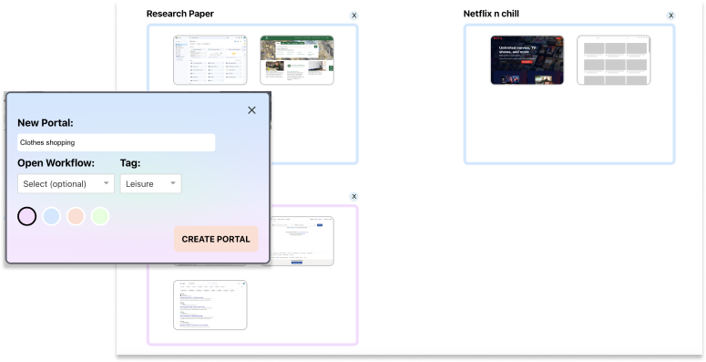
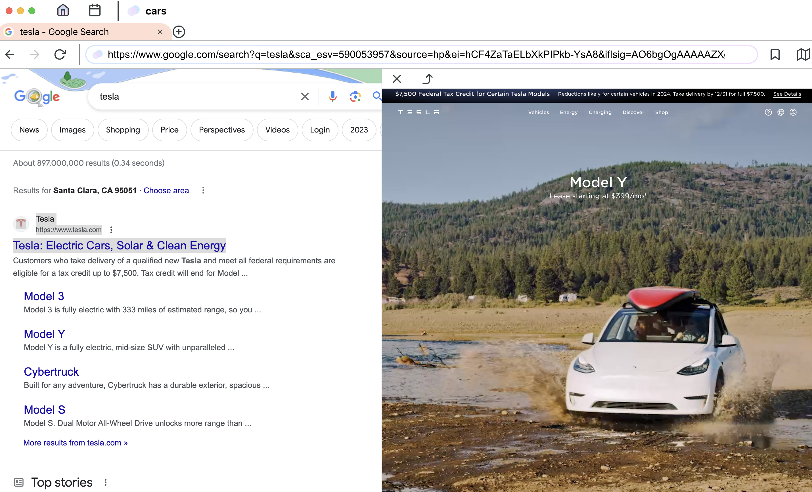
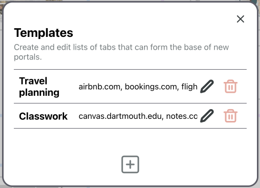
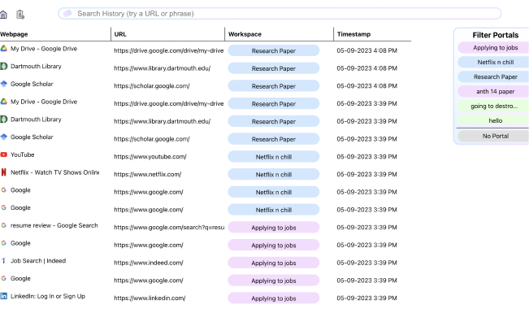

# Portal
Portal is a browser I built along with a team using Electron and React, with SQLite serving as our database (all data is stored locally on the users PC). Our goal is to help users reduce tab clutter and increase productivity when browsing. Users can create "Portals" to organize their browsing and group related tabs together. In addition, Portal allows users to preview websites in split-screen view, open a set of tabs with "templates", monitor their browsing with a timer, and much more. Learn more at [portal-browser.com](portal-browser.com).

## Try it out now!

### [Download](https://github.com/jasonchen2023/Portal-Browser/releases/tag/v1.0.0)

## Notable Features

#### Organize your tabs into Portals

Create portals to separate your browsing based on subject, whether they're work, play, or something else. Portal intelligently orders your workspaces based on relevance and shows previews of your open tabs so that you can easily remember where you left off.

#### Preview websites in split screen view

Hold 'X' and click on any link to see a preview of the page, preventing the unnecessary mindless CMD + Click to open links in new tabs (hey, we're all guilty of it). Then, convert it to a new tab, or close it immediately.

#### Create templates to open pre-defined tabs

Create a set of tabs for every occasion. Then, choose a template while creating a portal to quickly dive in to your task with all the websites you need already open.

#### Filter your history based on portals

View, sort, and even preview your browsing history to easily find pages you've visited before.

### And more!

Check out our website [portal-browser.com](portal-browser.com) for more features and download it [here](https://github.com/jasonchen2023/Portal-Browser/releases/tag/v1.0.0)!

## Credits and acknowledgments

Special thanks to Megan Ren, Ben Fernando, Isaac Feldman, Mark Tao, and Ben Korkowski for their contributions and collaboration.
